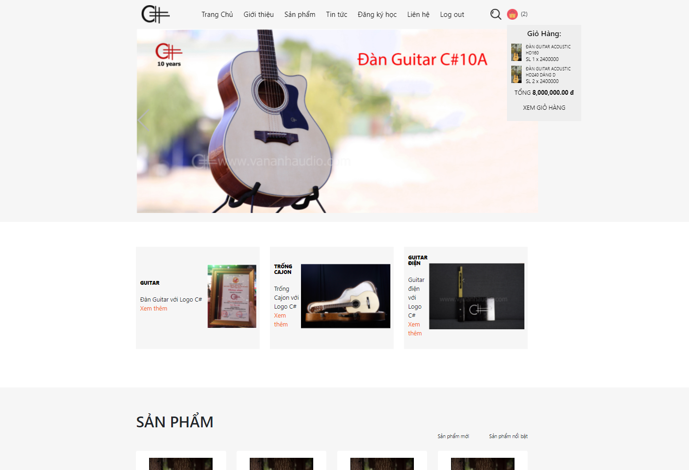
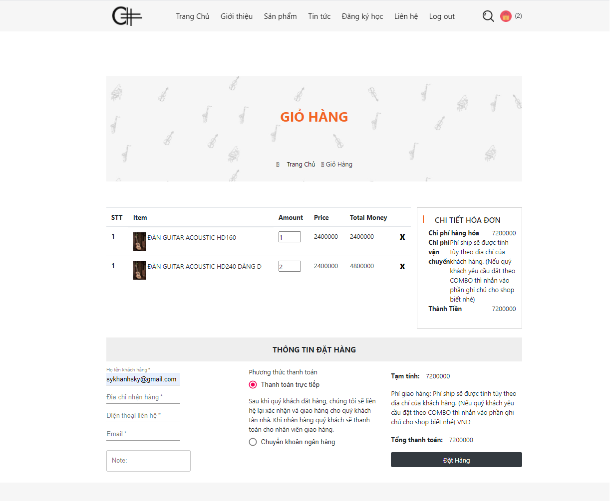

# Front-end for guitar Shop
> A website that sells guitar and other instruments, has almost the feature of
> the shop selling online. Buy instrument, add to cart, log-in, logout (using json-web-token). 
> Check the list order ( shipping, pending, received). Adding, removing 
> editing products.
> Managing orders (only admin).
## Installation
```bash
git clone https://github.com/phikhanhcr/Guitar-vananh
```
## Usage
```python
npm install 
npm start
```
## Contributing
Pull requests are welcome. For major changes, please open an issue first to discuss what you would like to change.
Please make sure to update tests as appropriate.

### Some images from this app 
> Homepage


>Cart
